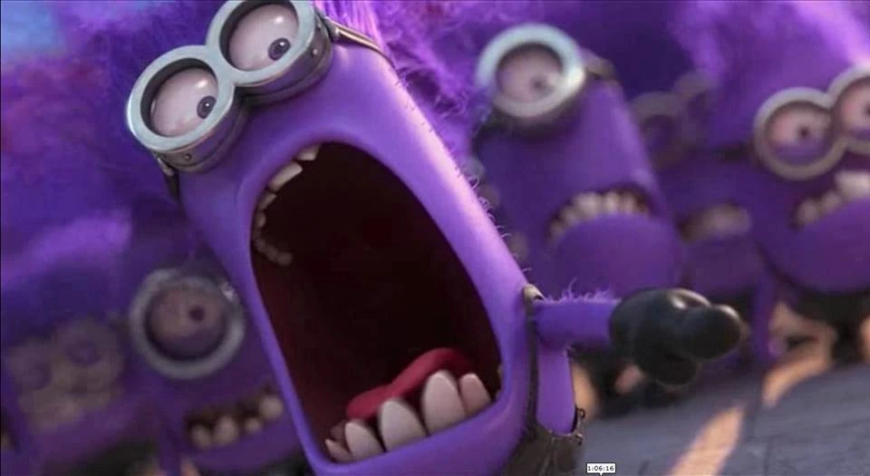
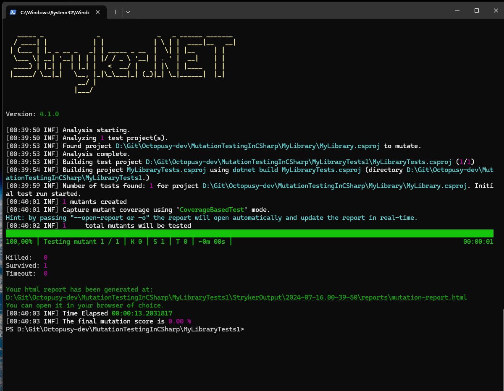
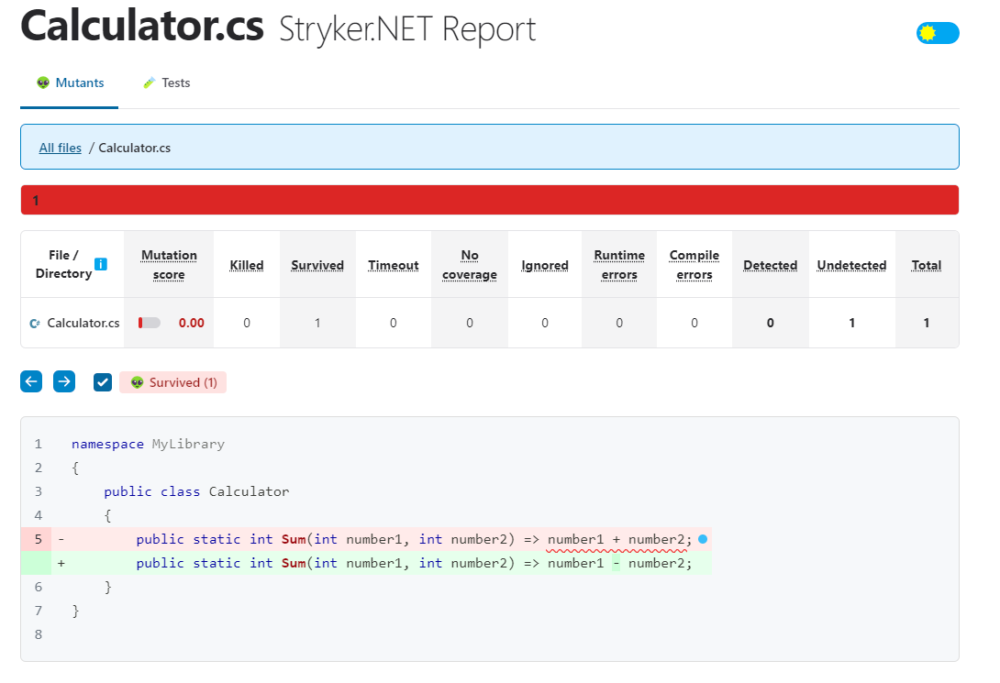
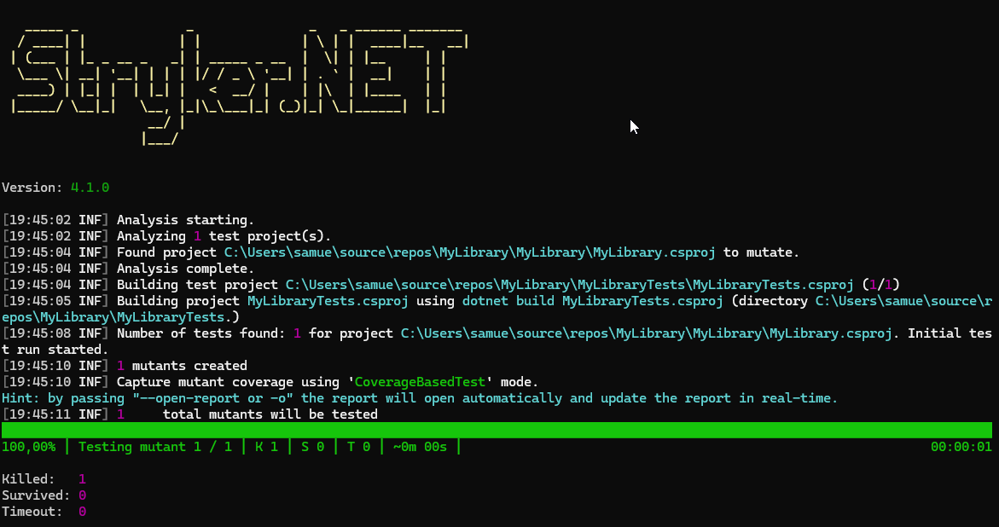
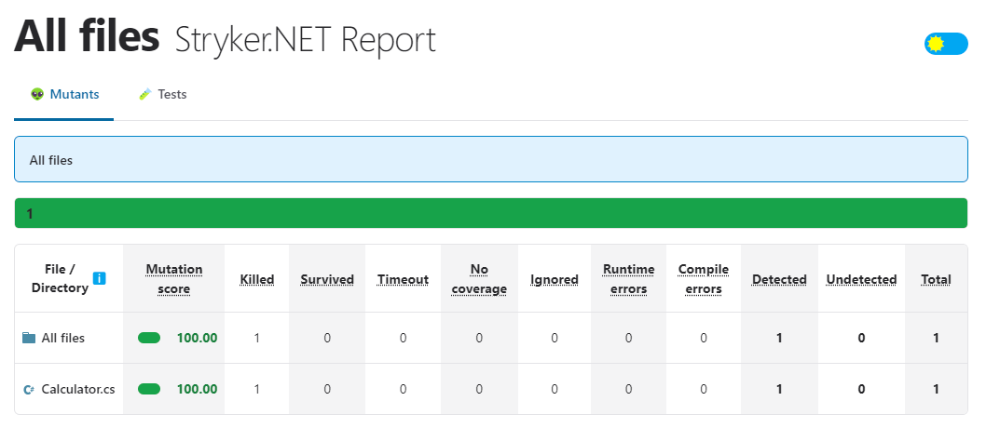

# Mutation testing en C# avec Stryker.NET

> pour lire correctement ce readme installer l'extension "[Markdown Editor v2](https://marketplace.visualstudio.com/items?itemName=MadsKristensen.MarkdownEditor2)"

## Introduction
Le but des tests de mutation est de tester nos tests unitaires. 
En effet, il est possible d'avoir des tests unitaires qui passent mais qui ne sont pas suffisamment robustes. Les tests de mutation permettent de vérifier la qualité de nos tests unitaires en modifiant le code source et en vérifiant si les tests unitaires échouent. 
Si les tests unitaires passent, c'est que les tests unitaires ne sont pas assez robustes.

## Objectif 
L'objectif est simple il s'agit de tester nos tests pour verifier leur robustesse. :smiley:

## Les bases 
### Le mutant


Un mutant est une version modifiée du code source.
Prenont par exemple le code source suivant :
```Csharp
public static int Sum(int number1, int number2) => number1 + number2;
```

son mutant sera
```Csharp
public static int Sum(int number1, int number2) => number1 - number2;
```
**Ce qui a changer ici c'est le signe + qui est devenu un -.**

Le principe est le suivant on prend  un operateur et on le remplace par son opposé
* le + deviens un -
* le - deviens un +
* le * deviens une /
* le / deviens un *

Bref tu as compris le principe :wink:
Je te met ici la source pour le reste des opérateurs [Supported mutators](https://stryker-mutator.io/docs/mutation-testing-elements/supported-mutators/#arithmetic-operator)

### Killed et Survived
* :ballot_box_with_check: Killed : Lorsqu’au moins un test échoue alors que ce mutant était actif, le mutant est tué. C'est ce que vous voulez, bon travail !
* :negative_squared_cross_mark: Survived : Si tous les tests passent, le mutant a survécu. C'est mauvais, vous devez améliorer vos tests.

> Ce qui veut dire que pour que tes test de mutation passe tu doit tous les tuer , meme highlander ne doit pas survivre, il ne peut en rester aucun.

### Et du coup ?
Et bien voila comment ca se passe, stryker va generer des mutants et les tester avec vos tests unitaires.
Si on as que des morts c'est que nos tests sont robustes, sinon il faudra les ameliorer.

## Process
### Installation de l'utilitaire
Pour installer l'utilitaire, il suffit de lancer la commande suivante dans le terminal de Visual Studio Code
Le **-g** permet d'installer l'utilitaire de maniere global

```bash
dotnet tool install -g dotnet-stryker
```

### Lancer les tests de mutation
* Placer vous dans le projet MyLibraryTests
* Ouvrer une ligne de commande
* Executer la commande suivante 
```bash
dotnet stryker
```

Vous devez avoir le resultat ci-dessous, on remarque que Killed est a 0 et Survived a 1
Pour que le test soit valide il faut que Killed soit superieur a 0 et Survived a 0
On peut voir dans le rapport la transformation que le code tester a subit





### Amelioration des tests
Maintenant on va modifier notre test unitaire pour qu'il soit plus robuste et qu'il tue le mutant.
Rajouter dans le fichier **UnitTest1.cs** la ligne suivante dans le bloc theory, ou cdecommante la ligne 11 du fichier
```Csharp
[InlineData(1, 1, 2)]
```

Youhou cette fois ci notre mutant a bien ete tuer , bye bye mutant :smiley:
Tu peut verifier dans le rapport ce resultat







## Pour aller plus loin 
* c'est integrable dans un pipeline de CI/CD :smirk:

## Sources
* [Mutation Testing with Stryker](https://engincanv.github.io/c%23/.net/stryker/2024/02/10/mutation-testing-in-c-sharp-with-stryker.html)
* [GitHub Stryker](https://stryker-mutator.io/docs/stryker-net/introduction/)